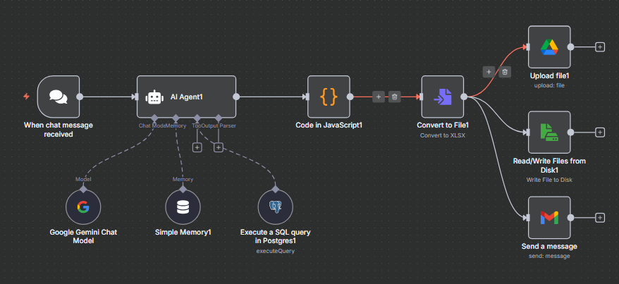

## 🚀 Versión 4: Envío de reportes por Email

Esta versión es una extensión directa de la V3. Habiendo resuelto la generación del archivo `.xlsx` y su guardado en Google Drive y el disco local, el último paso funcional era añadir la capacidad de enviar este reporte por email, completando otro de los requisitos principales del proyecto.

### Arquitectura de la V4

El flujo central hasta el nodo **"Convert to File"** es idéntico al de la Versión 3. La única modificación fue añadir una tercera rama de salida.

1.  **AI Agent** y **Code in JavaScript** preparan los datos.
2.  **Convert to File** genera el archivo `.xlsx` binario.
3.  El flujo ahora se divide en **tres caminos** para distribuir el archivo:
    * **Upload file:** Sube el archivo a Google Drive.
    * **Read/Write Files from Disk:** Guarda el archivo localmente.
    * **Send Email (NUEVO):** Un nuevo nodo que toma el archivo binario y lo adjunta a un correo electrónico, enviándolo a un destinatario específico.

Con esta adición, el sistema ahora puede generar y distribuir el reporte a través de todos los canales solicitados en la consigna del proyecto.
