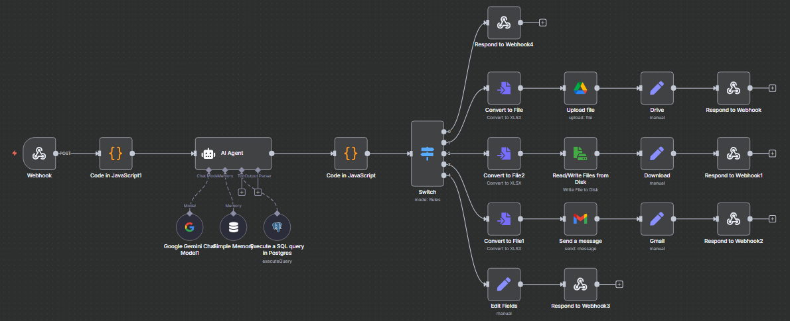
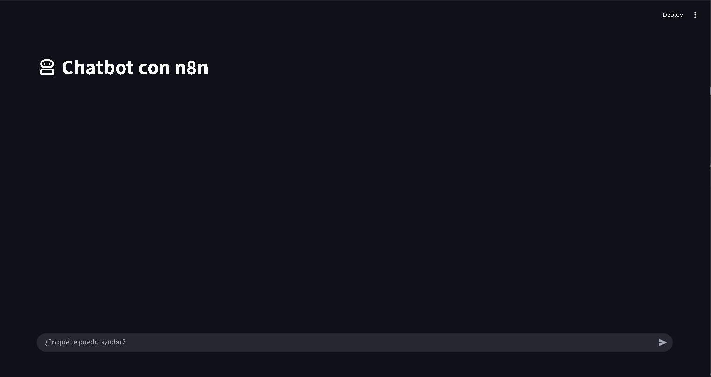

### 🚀 Versión 8: Implementación de Frontend con Streamlit y Corrección de Lógica

Esta versión marca un hito importante: la **primera implementación de una interfaz de usuario (UI) web** utilizando Streamlit. Se deja atrás la consola de Python (usada en V7) para interactuar con el chatbot, adoptando una interfaz simple pero funcional.

Además, se soluciona un error lógico clave en el backend de n8n, habilitando la rama de "mostrar" información, que ahora responde correctamente al frontend.

#### Arquitectura de la V8

Se observan los siguientes cambios y mejoras:

* **Frontend Básico con Streamlit (CAMBIO MAYOR):** Se introduce un frontend (`ChatBot.png`) que consiste en un campo de texto ("¿En qué te puedo ayudar?") y un botón de envío. Esta interfaz envía la consulta del usuario directamente al Webhook de n8n y es capaz de renderizar la respuesta de texto que recibe.

* **Solución de la Rama "Mostrar" (Acción = Mostrar):** Se corrigió la lógica del nodo `Switch` para la acción "mostrar". Ahora, cuando el `AI Agent` determina que el usuario solo quiere *ver* información (y no un archivo), el flujo se dirige correctamente a la rama superior del `Switch` (la que va a `Respond to Webhook4`), enviando la respuesta en texto plano de vuelta al frontend de Streamlit.

* **Flujo n8n (V8) Completo:** El flujo (`Versión8.png`) está ahora lógicamente completo. El `Switch` direcciona correctamente a las 5 ramas principales:
    1.  **Mostrar:** (¡NUEVO Y FUNCIONAL!) Respuesta de texto directa al webhook.
    2.  **Google Drive:** Genera .xlsx y sube a Drive.
    3.  **Descarga Local:** Genera .xlsx y lo prepara para descarga.
    4.  **Email:** Genera .xlsx y lo envía por Gmail.
    5.  **Error/Default:** Responde con un mensaje de error formateado.

#### Vistas del Sistema

**Flujo de Backend (n8n)**

**Interfaz de Usuario (Streamlit)**

---
