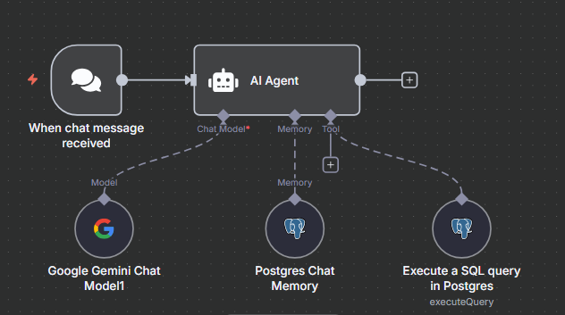

## 🚀 Versión 1: Consulta directa con AI Agent

Esta primera versión del flujo en n8n se centra en utilizar el nodo **AI Agent** como el cerebro central de la operación. El objetivo es que el agente reciba la pregunta, la entienda y ejecute una consulta SQL directamente.

### 🎥 Video Demo

[Ver video demo de la Versión 1](./Version1.mp4)

### Arquitectura de la V1

El flujo se dispara con el nodo **"When chat message received"**, que captura la pregunta del usuario (por ejemplo, la que llega desde la consola de Python).

Este mensaje pasa directamente al nodo **"AI Agent"**, que está configurado con tres componentes clave:

* **Chat Model (Modelo de Chat):** Se utiliza **Google Gemini Chat Model** para entender el lenguaje natural y procesar la solicitud.
* **Tool (Herramienta):** Se le da al agente la capacidad de ejecutar consultas SQL (`executeQuery`) directamente en una base de datos **Postgres**.
* **Memory (Memoria):** Se conecta a una **Postgres Chat Memory** para que el agente pueda recordar el contexto de la conversación.

En esta arquitectura, el agente de IA tiene la responsabilidad total de interpretar la pregunta del usuario, generar la consulta SQL adecuada y ejecutarla para obtener los datos.
