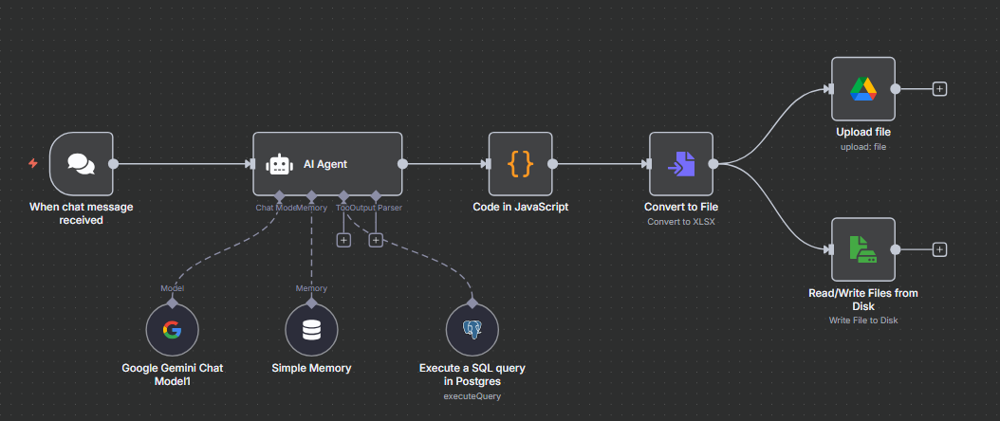

## 🚀 Versión 3: Solución de Excel (.xlsx) y Descarga Local

Esta versión soluciona el problema principal de la V2: la generación corrupta de archivos `.xlsx`. El flujo se rediseñó para asegurar que el archivo Excel se cree correctamente y, además, se añadió una nueva función para descargar el archivo localmente.

### Arquitectura de la V3

El cambio fundamental fue abandonar los nodos `Create Spreadsheet` y `Append row`. En su lugar, se implementó una lógica de conversión directa:

1.  **AI Agent (con Output Parser):** Sigue siendo responsable de recibir la consulta y generar una salida de datos estructurada (JSON).
2.  **Code in JavaScript:** El código de este nodo se modificó para tomar el JSON del agente y formatearlo limpiamente en un array de objetos, que es el formato que esperan los nodos de conversión.
3.  **Convert to File (NUEVO):** Este es el nodo clave de la solución. Toma el array de objetos del paso anterior y lo convierte directamente en un archivo binario `.xlsx`. Esto elimina los errores de formato que ocurrían en la V2.
4.  **Bifurcación de Salida:** Una vez que el archivo binario está listo, el flujo se divide para enviarlo a dos destinos:
    * **Upload file:** Sube el archivo `.xlsx` a Google Drive (cumpliendo un requisito del proyecto).
    * **Read/Write Files from Disk (NUEVO):** Guarda una copia del archivo `.xlsx` en el disco local del servidor donde se está ejecutando n8n.

### Resultado

Con esta nueva arquitectura, el archivo Excel se genera perfectamente, con los datos estructurados en las columnas y filas correctas.

