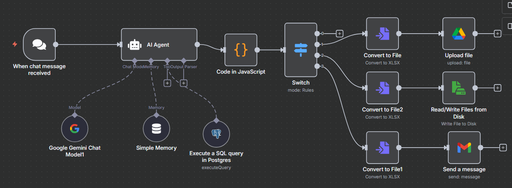

## 🚀 Versión 5: Prueba de Estructura Condicional (No Funcional)

Esta versión representa un rediseño conceptual clave. El objetivo aquí no era que el flujo funcionara, sino **armar la estructura** de cómo el sistema tomaría decisiones.

*(Nota: Asegúrate de que tu imagen se llame `Version5.png` y esté en la misma carpeta que este README).*

### Arquitectura de la V5

El cambio más importante es la introducción de un nodo **"Switch"**.

A diferencia de la V4 (que ejecutaba *todas* las salidas en paralelo), esta nueva estructura se preparó para una lógica condicional. La idea a futuro era:

1.  Que el **AI Agent** detectara la *intención* del usuario (ej: "generá el excel", "enviámelo por mail", "guárdalo en drive").
2.  Que el nodo **Switch** leyera esa intención.
3.  Que el flujo se dirigiera a **una sola rama** (Email, Google Drive o Descarga local), en lugar de a las tres al mismo tiempo.

Se duplicaron los nodos `Convert to File` en cada rama solo para maquetar la estructura visual.

### ⚠️ Estado del Flujo

**Este flujo no es funcional.** Fue un paso intermedio para diseñar y planificar la lógica del flujo final antes de implementarla.
