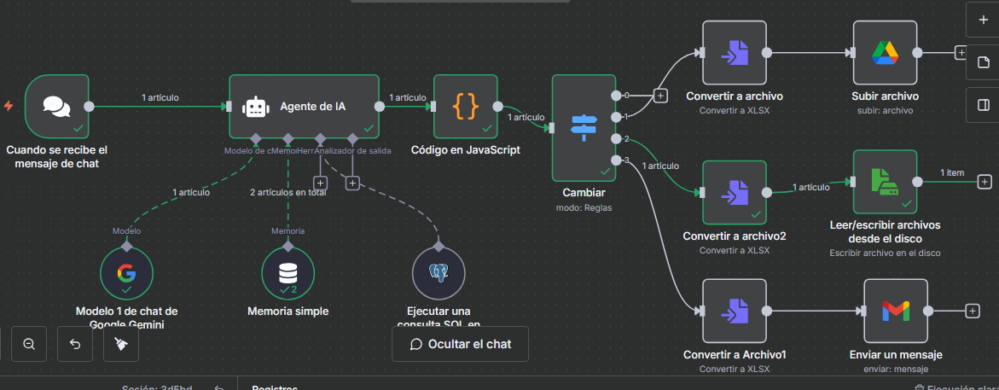

## 🚀 Versión 6: Lógica Condicional Funcional (con "Switch")

Esta es la versión funcional que implementa la lógica de decisión planificada en la V5. El sistema ahora es capaz de entender la *intención* del usuario y ejecutar una sola acción específica, en lugar de todas a la vez.

### 🎥 Video Demo

[Ver video demo de la Versión 6](./Version6.mp4)

### Arquitectura de la V6

El éxito de esta versión se basa en dos cambios cruciales:

1.  **Modificación del Agente de IA:** Se ajustó el *prompt* (el mensaje) del **Agente de IA** para que, además de procesar la consulta y devolver los datos, también devuelva un parámetro clave llamado `accion`.
    * *Ejemplo:* Si el usuario dice "Enviá por mail el reporte de tickets", la IA debe procesar la consulta SQL y además devolver `accion: "email"`.

2.  **Modificación del "Código en JavaScript":** Este nodo ahora lee la salida del Agente de IA y extrae el parámetro `accion`, enviándolo de forma limpia al siguiente nodo.

3.  **Implementación del "Switch" (Cambiar):** Este es el cerebro de la lógica. El nodo **Switch** recibe el parámetro `accion` y dirige el flujo de datos a una sola rama, según el valor:
    * Si `accion` es "drive", activa la rama de **Google Drive**.
    * Si `accion` es "local", activa la rama de **Descarga Local**.
    * Si `accion` es "email", activa la rama de **Enviar Mensa-je**.

Con este diseño, el flujo se vuelve eficiente y cumple exactamente con lo que el usuario pide en lenguaje natural.
