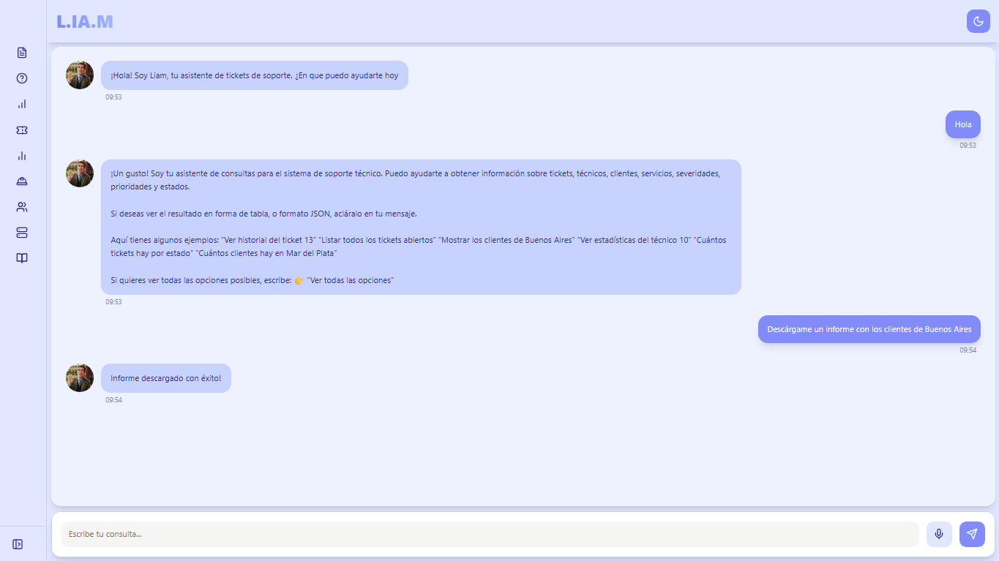

### 🚀 Versión 9: Migración a React y Mejoras de Usabilidad

Esta versión representa la evolución más significativa del proyecto hasta la fecha, centrada en la **migración completa del frontend de Streamlit a React**. Este cambio fundamental no solo moderniza la interfaz de usuario (UI), sino que también soluciona errores críticos de versiones anteriores y mejora la presentación de los datos al usuario.

La lógica del backend en n8n se mantiene robusta, pero la nueva interfaz de React, llamada **"L.IA.M"**, proporciona una experiencia de chat profesional, con modos claro y oscuro, y una mejor legibilidad.

Se observan los siguientes cambios y mejoras:

* **Migración del Frontend a React (CAMBIO MAYOR):** Se ha descartado por completo la interfaz de usuario basada en Streamlit. En su lugar, se desarrolló un frontend dedicado en React. Esto permite:
    * Un diseño de chat moderno y profesional.
    * Funcionalidad nativa de **modo claro y modo oscuro** (como se ve en las capturas de pantalla).
    * Mayor control sobre el estado de la aplicación y la interacción del usuario.
      
    
    
  
* **Solución de Error en Ruta de Guardado:** Se ha corregido el error persistente relacionado con la ruta de guardado de archivos. La rama de "Descarga Local" ahora funciona correctamente, guardando los archivos .xlsx en la ubicación deseada sin fallos, como se confirma en el mensaje del bot: "Informe descargado con éxito!".

* **Optimización de Reportes .xlsx:** Atendiendo al feedback, se ha modificado la generación de archivos Excel. **Se eliminó la columna "Acción"** de todos los reportes .xlsx, resultando en exportaciones más limpias y centradas únicamente en los datos solicitados.

* **Formato de Lista para Consultas:** Las respuestas del chatbot que devuelven múltiples resultados (por ejemplo, "listar todos los tickets abiertos") ahora se presentan en un **formato de lista legible** dentro de la interfaz de React, mejorando significativamente la usabilidad en comparación con la salida de texto plano anterior.

* **Análisis del Flujo n8n (V9):** El flujo de backend (visible en `Versión9.png`) mantiene la misma estructura lógica central, pero adaptado a la nueva interfaz:
    * **Entrada (`Webhook`):** Recibe las solicitudes POST desde el frontend de React.
    * **Lógica Central (`AI Agent`):** El agente de IA (Gemini) sigue utilizando la memoria y la conexión a PostgreSQL para interpretar la consulta y acceder a la base de datos.
    * **Router (`Switch`):** El nodo `Switch` sigue siendo el cerebro que direcciona la solicitud a la rama de acción correcta (Respuesta de texto, Google Drive, Descarga Local, Email o Error).
    * **Ramas de Acción:**
        * **Descarga Local:** Esta rama (`Code in JavaScript4` -> `Convert to File2`... -> `Respond to Webhook1`) está ahora 100% funcional gracias a la corrección de la ruta de guardado. Es la que responde al frontend con el mensaje de éxito.
        * **Otras Ramas (Drive, Email):** Siguen operativas.
        * **Respuesta de Texto:** La rama `Code in JavaScript2` -> `Respond to Webhook4` maneja las conversaciones simples (saludos, preguntas generales) que no requieren generar un archivo.

#### 🐞 Errores Conocidos / Asuntos Pendientes

* **Entrada de Voz NO Funcional:** A pesar de la migración a React, la funcionalidad de entrada por voz (micrófono) **sigue sin funcionar**. Este es el principal error pendiente a solucionar en la próxima iteración.

---
